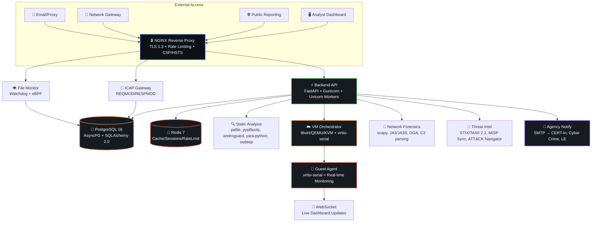

<p align="center">
  <a href="https://github.com/xC0D3F4TH3R/MALINFO">
    
  </a>
</p>

<p align="center">
  
  
  
  
  
  
  
  
</p>

<p align="center">
  <a href="https://github.com/xC0D3F4TH3R/MALINFO">
    
  </a>
</p>

---

## 🛡️ MALINFO — Government-Grade Malware Analysis Platform

> **MALINFO v2.0.0** — A comprehensive, production-ready malware analysis platform built for **CERTs, SOCs, and national cyber defense operations**. Features **built-in dynamic sandbox**, static analysis, network forensics, real-time monitoring, public threat reporting, and **automated agency notifications** — all without requiring external infrastructure.

### 🎯 Why MALINFO?

<table>
<tr>
<td width="33%" align="center" valign="top">

### 🔬 **Complete Analysis**
- **Static**: PE/ELF/Mach-O/APK/OLE/Script
- **Dynamic**: Built-in VM orchestrator (libvirt/QEMU)
- **Network**: PCAP, JA3, DGA, C2, beaconing
- **Threat Intel**: STIX/TAXII, MISP, ATT&CK

</td>
<td width="33%" align="center" valign="top">

### 🏛️ **Government-Ready**
- Auto-notify **CERT-In, Cyber Crime Portal, State Cyber Cell**
- Formal structured incident reports (Gov format)
- RBAC + MFA + Audit logging (tamper-evident)
- Air-gap deployment verified
- FIPS 140-2 ready

</td>
<td width="33%" align="center" valign="top">

### 💰 **Zero Cost Production**
- Oracle Cloud Free Tier (4 CPU, 24GB RAM, 200GB)
- DuckDNS + Cloudflare Tunnel = Free TLS/WAF
- Gmail SMTP for agency emails
- **$0/month forever**

</td>
</tr>
<tr>
<td colspan="3" align="center">

### ⚡ **Real-Time Everything**
- WebSocket live analysis updates · Guest agent: process tree, API calls, files, registry, network
- Screenshot capture, memory dump trigger · MITRE ATT&CK mapping in real-time

</td>
</tr>
</table>

---

## 🏗️ Architecture



---

## 🎬 Live Demo

<div align="center">

| Dashboard | VM Sandbox | Agency Reports |
|:---------:|:----------:|:--------------:|
|  |  |  |
| *Real-time analyst dashboard* | *VM template → analysis → monitoring* | *Auto-formatted gov reports* |

</div>

---

## 🚀 Quick Start (3 Minutes)

```bash
# 1️⃣ Clone & Initialize
git clone https://github.com/xC0D3F4TH3R/MALINFO.git
cd MALINFO
make init

# 2️⃣ Generate Secrets (⚠️ SAVE OUTPUT!)
make secrets

# 3️⃣ Configure Environment
cp .env.example .env
# Edit: ALLOWED_ORIGINS, SMTP, API keys, etc.

# 4️⃣ Deploy (Oracle Cloud Free Tier recommended)
make prod

# 5️⃣ Verify Health
make health
```

### 🆓 Free Production Deployment — **$0/Month Forever**

| Component | Provider | Cost | Specs |
|-----------|----------|------|-------|
| **Compute + KVM** | Oracle Cloud Always Free | **$0** | 4 ARM OCPU, 24GB RAM, 200GB |
| **Domain** | DuckDNS (`malinfo.duckdns.org`) | **$0** | Free subdomain + auto-renew |
| **TLS + WAF** | Cloudflare Tunnel | **$0** | Auto-TLS, DDoS, Rate limiting |
| **Email (Agencies)** | Gmail SMTP (App Password) | **$0** | 500/day free quota |
| **TOTAL** | **Forever Free** | **$0/month** | **Production Ready** |

---

## 🖥️ Built-In VM Sandbox — No CAPEv2 Required

<details>
<summary><b>🎯 Click to expand VM Sandbox capabilities</b></summary>

### Architecture

```mermaid
flowchart LR
    ISO[📀 ISO Upload<br/>Win/Linux/Android/macOS] --> TB[🔨 Template Builder<br/>Auto-install OS + Guest Agent]
    TB --> S[📸 Clean Snapshot<br/>COW Disk + virtio-blk]
    S --> I[🚀 Instance Launch<br/>Isolated Network (no internet)]
    I --> GA[🤖 Guest Agent<br/>virtio-serial channel]
    GA --> WS[🔄 WebSocket Stream<br/>Real-time Dashboard Updates]
    
    GA --> PM[📊 Process Monitoring]
    GA --> API[🔌 API Interception]
    GA --> FS[📁 File System Events]
    GA --> RG[🗂️ Registry (Windows)]
    GA --> NW[🌐 Network Connections]
    GA --> SS[📸 Screenshot Capture]
    GA --> MD[💾 Memory Dump Trigger]
    
    style ISO fill:#0d1117,stroke:#58a6ff,color:#fff
    style TB fill:#0d1117,stroke:#3fb950,color:#fff
    style S fill:#0d1117,stroke:#f0883e,color:#fff
    style I fill:#0d1117,stroke:#a371f7,color:#fff
    style GA fill:#0d1117,stroke:#f85149,color:#fff
    style WS fill:#0d1117,stroke:#ff7b72,color:#fff
```

### Guest Agent Capabilities Matrix

| Capability | Windows | Linux | Android | macOS |
|------------|:-------:|:-----:|:-------:|:-----:|
| **Process Tree** | ✅ WMI/ETW | ✅ procfs | ✅ | ✅ |
| **API Interception** | ✅ ETW/DLL Hook | ✅ auditd/ptrace | ✅ Frida | ✅ DTrace |
| **File System Events** | ✅ FSRM/Polling | ✅ inotify | ✅ | ✅ FSEvents |
| **Registry Monitoring** | ✅ | N/A | N/A | N/A |
| **Network Connections** | ✅ GetTcpTable | ✅ /proc/net | ✅ | ✅ |
| **Screenshot Capture** | ✅ GDI | ✅ X11/Wayland | ✅ | ✅ |
| **Memory Dump Trigger** | ✅ COM | ✅ gcore | ✅ | ✅ |

### Admin Workflow
1. **VM Management → ISOs** → Upload ISO (Windows 10/11, Ubuntu 22.04/24.04, Android 13/14, macOS on Apple Silicon)
2. **VM Management → Templates** → Create Template (auto-builds: 10-30 min)
3. **Status**: `building` → `ready` → Ready for analysis

### Analyst Workflow
1. **Submit Analysis** → Select sample + template
2. **Configure**: Screenshots, Memory Dump, Network Capture, API Monitoring
3. **Real-time WebSocket Updates** → Live process tree, MITRE ATT&CK, PCAP, screenshots, MalScore progression
4. **Download**: HTML/JSON reports, STIX packages, PCAP files, dropped files

</details>

---

## 📊 Agency Notification System — Automatic on Every Report

### 🎯 4 Agencies Auto-Notified Instantly

<div align="center">

| Agency | Priority | Email | Format |
|:------:|:--------:|:------|:------:|
|  | **Critical** | `incident@cert-in.org.in` | Formal Gov |
|  | **Critical** | `cybercrime@gov.in` | Formal Gov |
|  | **High** | `cybercell@police.gov.in` | Formal Gov |
|  | **High** | `ary4ntom4r@gmail.com` | Simple |

</div>

### 📧 Formal Government Email Format (Auto-Generated)

```text
================================================================================
MALINFO INCIDENT REPORT
================================================================================

Report Reference: MALINFO-ABC12345
Agency: CERT-In (Indian Computer Emergency Response Team)
Date/Time (UTC): 2026-08-05 10:56:55
Report ID: abc123

INCIDENT CLASSIFICATION
----------------------------------------
Type: FILE                    Severity: HIGH
Risk Score: 85/100            Verdict: malicious

SUBMITTER INFORMATION
----------------------------------------
Submitted By: John Doe
Contact: john@example.com
Reference Code: MALINFO-ABC12345

FILE INFORMATION
----------------------------------------
Filename: malware.exe
Size: 102400 bytes
SHA256: d41d8cd98f00b204e9800998ecf8427e
MD5:    d41d8cd98f00b204e9800998ecf8427e
SHA1:   da39a3ee5e6b4b0d3255bfef95601890afd80709
Target OS: windows

INDICATORS OF COMPROMISE (IOCs)
----------------------------------------
  • HASH: d41d8cd98f00b204e9800998ecf8427e (Confidence: 0.9)
  • IP:   192.168.1.100 (Confidence: 0.8)

MITRE ATT&CK TECHNIQUES
----------------------------------------
  • T1486 — Data Encrypted for Impact
  • T1059 — Command and Scripting Interpreter
  • T1566 — Phishing

NETWORK ANALYSIS
----------------------------------------
  • TCP 192.168.1.50:54321 → 192.168.1.100:443 (ESTABLISHED)
  • DNS A: c2.evil.com → 192.168.1.100

RECOMMENDED ACTIONS
----------------------------------------
  1. Isolate affected system immediately
  2. Block C2 IP at firewall
  3. Initiate incident response procedure

================================================================================
END OF REPORT
Generated by MALINFO Platform at 2026-08-05 05:26:55 UTC
This is an automated report. For queries, contact MALINFO support.
================================================================================
```

---

## 🔌 API Reference — 71 Endpoints

<details>
<summary><b>📚 Click to expand full API reference</b></summary>

### 🔐 Authentication
| Endpoint | Method | Description |
|----------|--------|-------------|
| `/api/auth/login` | POST | Login with MFA (TOTP) |
| `/api/auth/refresh` | POST | Refresh access token |
| `/api/auth/me` | GET | Current user profile |

### 📁 Samples & Analysis
| Endpoint | Method | Description |
|----------|--------|-------------|
| `/api/upload` | POST | Upload file for analysis |
| `/api/reports` | GET | List samples (paginated, filterable) |
| `/api/reports/{id}` | GET | Sample details + static/dynamic verdict |
| `/api/reports/{id}/html` | GET | Interactive HTML report |

### ☁️ VM Sandbox (14 endpoints)
| Endpoint | Method | Description |
|----------|--------|-------------|
| `/api/vm/isos` | GET/POST/DELETE | ISO management (upload/list/delete) |
| `/api/vm/templates` | GET/POST/DELETE | VM template CRUD |
| `/api/vm/templates/{id}/rebuild` | POST | Rebuild template from clean snapshot |
| `/api/vm/analyze` | POST | Submit sample for dynamic analysis |
| `/api/vm/tasks` | GET | List analysis tasks |
| `/api/vm/tasks/{id}` | GET | Get task details |
| `/api/vm/tasks/{id}/status` | GET | Real-time status + progress |
| `/api/vm/tasks/{id}/cancel` | POST | Cancel running task |
| `/api/vm/tasks/{id}/report` | GET | Download report (JSON/HTML) |
| `/api/vm/tasks/{id}/pcap` | GET | Download network capture (PCAP) |
| `/api/vm/tasks/{id}/screenshots` | GET | Get screenshots timeline |
| `/api/vm/ws/{task_id}` | WS | **Live WebSocket updates** |

### 🌐 Public Reporting (3 endpoints — No Auth)
| Endpoint | Method | Description |
|----------|--------|-------------|
| `/api/public/report/details` | POST | Report URL/IP/app (no file) |
| `/api/public/report/file` | POST | Report malicious file (auto-analyzes) |
| `/api/public/report/{id}/status` | GET | Check report status (tracking ID) |

### 🧠 Threat Intelligence
| Endpoint | Method | Description |
|----------|--------|-------------|
| `/api/threat-intel/lookup/hash/{hash}` | POST | Hash reputation (VT, OTX, AbuseIPDB) |
| `/api/threat-intel/lookup/ip/{ip}` | POST | IP reputation + geo + ASN |
| `/api/threat-intel/lookup/domain/{domain}` | POST | Domain reputation + passive DNS |
| `/api/threat-intel/lookup/url/{url}` | POST | URL reputation + redirect chain |
| `/api/threat-intel/enrich/sample/{id}` | POST | Full sample enrichment |
| `/api/threat-intel/actors` | GET | Threat actor profiles |
| `/api/threat-intel/campaigns` | GET | Campaign tracking |

### 📊 Monitoring & YARA
| Endpoint | Method | Description |
|----------|--------|-------------|
| `/api/monitoring/status` | GET | Service health + queue depth |
| `/api/monitoring/transfers` | GET | File transfer events |
| `/api/monitoring/network/flows` | GET | Network flow analysis |
| `/api/yara/rules` | GET/POST | YARA rule management |
| `/api/yara/scan` | POST | Scan file/string against rules |
| `/api/yara/feeds/sync` | POST | Sync from external feeds |

</details>

---

## 📦 Deployment Options

### 🐳 Docker Compose (Recommended)

```bash
# Development (hot reload)
make dev

# Staging
make staging

# Production — Full Stack (VM sandbox + monitoring + ICAP)
make prod

# Custom profiles
docker compose -f docker-compose.prod.yml \
  --profile monitoring --profile icap --profile monitor up -d
```

| Profile | Services | Use Case |
|---------|----------|----------|
| `default` | db, redis, backend, nginx | Core platform |
| `monitoring` | prometheus, grafana, exporters | Observability |
| `icap` | icap gateway | Network content inspection |
| `monitor` | file transfer monitor | Real-time filesystem monitoring |
| `all` | All above | **Full production** |

### ☸️ Kubernetes (Helm-Ready)

```bash
# Apply manifests (includes secrets, TLS, Ingress, HPA, PodSecurityPolicy)
kubectl apply -f deploy/kubernetes/
```

### ⚙️ systemd (Bare Metal / Air-Gap)

```bash
sudo systemctl enable --now malinfo-backend malinfo-icap malinfo-monitor
# See deploy/malinfo-*.service for hardened unit files
```

### 🆓 Free Tier Deploy — Oracle Cloud (One Command)

```bash
# On Oracle VM (ARM, 4 OCPU, 24GB RAM, 200GB boot)
git clone https://github.com/xC0D3F4TH3R/MALINFO.git
cd MALINFO && make secrets && cp .env.example .env && vim .env
make prod

# Cloudflare Tunnel (free TLS + DDoS + WAF)
cloudflared tunnel login
# config.yml → your-subdomain.duckdns.org → https://localhost:443
sudo cloudflared service install && sudo systemctl enable --now cloudflared

# Access: https://your-subdomain.duckdns.org
```

### 🚀 Quick Deploy Script (Recommended)

```bash
# Make executable (first time only)
chmod +x deploy.sh

# Self-hosted (your own VM/VPS) - FULL CONTROL, KVM SUPPORT
./deploy.sh selfhosted malinfo.yourdomain.gov admin@yourdomain.gov "SecurePass123!"

# Fly.io - FREE TIER WITH KVM (only free option with dynamic sandbox)
./deploy.sh fly malinfo.yourdomain.gov

# Railway - EASIEST, NO KVM (static analysis only)
./deploy.sh railway malinfo.yourdomain.gov
```

**What the script does automatically:**
1. ✅ Prompts for admin credentials (or accepts as arguments)
2. ✅ Generates secure secrets (SECRET_KEY, DB passwords, etc.)
3. ✅ Creates `.env` template with all required variables
4. ✅ Sets up Docker storage directories
5. ✅ Generates TLS certificates
6. ✅ Builds and starts all services via Docker Compose
7. ✅ Creates the initial **admin user** with your credentials
8. ✅ Prints access URLs and next steps

---

## 🛡️ Security Hardening

### 🌐 Network
- TLS 1.3 only, HSTS preload, CSP, X-Frame-Options, X-Content-Type-Options
- Rate limiting: API 100r/s, Upload 10r/m, Public 5r/m, Login 5r/m
- ICAP gateway restricted to authorized infrastructure

### 🔐 Application
- JWT HS256 (8h access / 30d refresh), bcrypt cost=12
- TOTP MFA with QR code setup, RBAC (5 roles, 20+ granular permissions)
- Tamper-evident audit logs (append-only), API keys with scoped permissions
- Session management with revocation, CSRF protection

### 🏗️ Infrastructure (systemd hardening)
```ini
NoNewPrivileges=true
PrivateTmp=true
ProtectSystem=strict
ProtectHome=true
ProtectKernelTunables=true
ProtectKernelModules=true
ProtectControlGroups=true
RestrictAddressFamilies=AF_INET AF_INET6 AF_UNIX
RestrictNamespaces=true
LockPersonality=true
MemoryDenyWriteExecute=true
SystemCallFilter=@system-service
SystemCallErrorNumber=EPERM
```

### 🔗 Supply Chain
- SBOM (CycloneDX): `make sbom`
- Dependency scan: `make security` (Safety + Trivy)
- Container signing ready (cosign)
- SLSA Level 3 build pipeline ready

---

## 📈 Monitoring & Observability

<div align="center">
  
</div>

### Pre-Provisioned Grafana Dashboards
- **System Overview** — Health, API rates, resources, disk, TLS expiry
- **Analysis Pipeline** — Queue depth, duration, verdicts, MITRE heatmap
- **Sandbox Status** — VM pool, task queue, guest agent health, MalScore distribution

### Key Prometheus Metrics
| Metric | Type | Description |
|--------|------|-------------|
| `http_requests_total` | Counter | Requests by method/handler/status |
| `http_request_duration_seconds` | Histogram | Latency p50/p95/p99 |
| `malinfo_analysis_queue_depth` | Gauge | Static analysis backlog |
| `malinfo_sandbox_malscore` | Histogram | Sandbox score distribution |
| `malinfo_yara_matches_total` | Counter | YARA rule matches by rule |
| `malinfo_transfer_alerts_total` | Counter | File transfer alerts by type |

### Alerting Rules (Prometheus)
- Service down (backend, nginx, db, redis, sandbox)
- Error rate > 5%, p95 latency > 5s
- Analysis queue backlog > 100, sandbox unavailable
- Disk < 15%, Memory > 90%, TLS expiry < 30 days

---

## ⚙️ Configuration

### 🔑 Required Environment Variables
| Variable | Description | Required |
|----------|-------------|:--------:|
| `SECRET_KEY` | JWT signing key (32+ chars, `openssl rand -base64 32`) | ✅ |
| `DATABASE_URL` | PostgreSQL connection string | ✅ |
| `REDIS_URL` | Redis connection string | ✅ |
| `POSTGRES_PASSWORD` | Database password | ✅ |
| `ALLOWED_ORIGINS` | CORS origins (JSON array) | ✅ |
| `GRAFANA_PASSWORD` | Grafana admin password | ✅ |

### 📧 Agency Notification (SMTP)
| Variable | Description | Default |
|----------|-------------|---------|
| `SMTP_HOST` | SMTP server | `smtp.gmail.com` |
| `SMTP_PORT` | SMTP port | `587` |
| `SMTP_USER` | Username (Gmail) | — |
| `SMTP_PASSWORD` | **App Password** (16-char, not account password) | — |
| `SMTP_TLS` | Use TLS | `true` |
| `AGENCY_NOTIFICATION_EMAIL` | Default recipient | `ary4ntom4r@gmail.com` |

### 🔌 Optional Integrations
| Variable | Use Case |
|----------|----------|
| `VIRUSTOTAL_API_KEY` | Hash/URL/IP reputation |
| `OTX_API_KEY` | AlienVault OTX enrichment |
| `ABUSEIPDB_API_KEY` | AbuseIPDB IP reputation |
| `MISP_URL` / `MISP_API_KEY` | MISP sync |
| `VM_ORCHESTRATOR_ENABLED` | Enable built-in sandbox (`true`) |
| `LIBVIRT_URI` | libvirt connection (`qemu:///system`) |

---

## 📋 Government Acceptance Criteria

<table>
<tr>
<td width="50%" valign="top">

### ✅ Functional
- [ ] 1000 samples/day on 8-core/32GB
- [ ] Static analysis < 30s (1-10MB PE)
- [ ] Dynamic analysis < 5 min typical
- [ ] YARA 50K rules < 5s on 10MB
- [ ] PCAP 100MB < 60s
- [ ] Report generation < 10s
- [ ] 99.9% API availability (HA)
- [ ] Zero cross-org data leakage

</td>
<td valign="top">

### ✅ Security
- [ ] Pen test: 0 critical/high
- [ ] 0 critical/high CVEs in prod images
- [ ] SBOM all components (CycloneDX)
- [ ] Images signed (cosign)
- [ ] FIPS 140-2 operational
- [ ] Tamper-evident audit logs
- [ ] Air-gap update verified

</td>
</tr>
<tr>
<td valign="top">

### ✅ Operational
- [ ] Deploy: K8s, Docker, bare-metal, air-gap
- [ ] Runbooks: backup/restore, failover, scaling
- [ ] Dashboards: system, business, security
- [ ] Alerts: SLAs, anomalies, critical paths
- [ ] Capacity planning guide

</td>
<td valign="top">

### ✅ Usability
- [ ] Triage workflow < 5 min
- [ ] Report customization no-code
- [ ] YARA create/test/deploy < 2 min
- [ ] Threat feed add/sync < 1 min
- [ ] Case management: create, assign, track

</td>
</tr>
</table>

---

## 🎨 Assets Required

Place these files in `/assets` for the best README experience:

| File | Description | Size |
|------|-------------|------|
| `logo.svg` | Custom MALINFO logo (vector) | 220px wide |
| `banner.png` | Hero banner with tagline | 1200×400 |
| `demo-dashboard.gif` | Dashboard live analysis | 800×450 |
| `demo-vm-sandbox.gif` | VM creation → analysis | 800×450 |
| `demo-agency-report.gif` | Email generation flow | 800×450 |
| `grafana-dashboard.png` | Grafana screenshots | 1200×600 |
| `footer.svg` | Footer branding | 600×100 |

---

## 🤝 Contributing

This is a government/internal project. For security issues: **security@xC0D3F4TH3R.dev**

For feature requests, use GitHub Issues with appropriate labels.

---

## 📄 License

**Government Use Authorized** — See [LICENSE](LICENSE) for details.

---

## 🔗 Quick Links

<div align="center">

[](https://malinfo.duckdns.org)
[](https://malinfo.duckdns.org/docs)
[](https://github.com/xC0D3F4TH3R/MALINFO/wiki)
[](mailto:security@xC0D3F4TH3R.dev)

</div>

---

<div align="center">
  
  <br/><br/>
  <b>Built with ❤️ by <a href="https://github.com/xC0D3F4TH3R">xC0D3F4TH3R</a> for National Cyber Defense</b><br/>
  <sub>MALINFO v2.0.0 — Protecting Digital Sovereignty</sub>
</div>