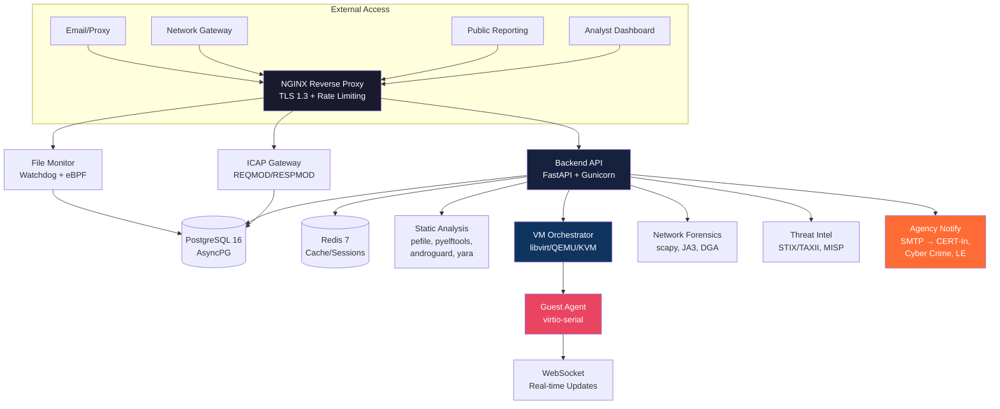
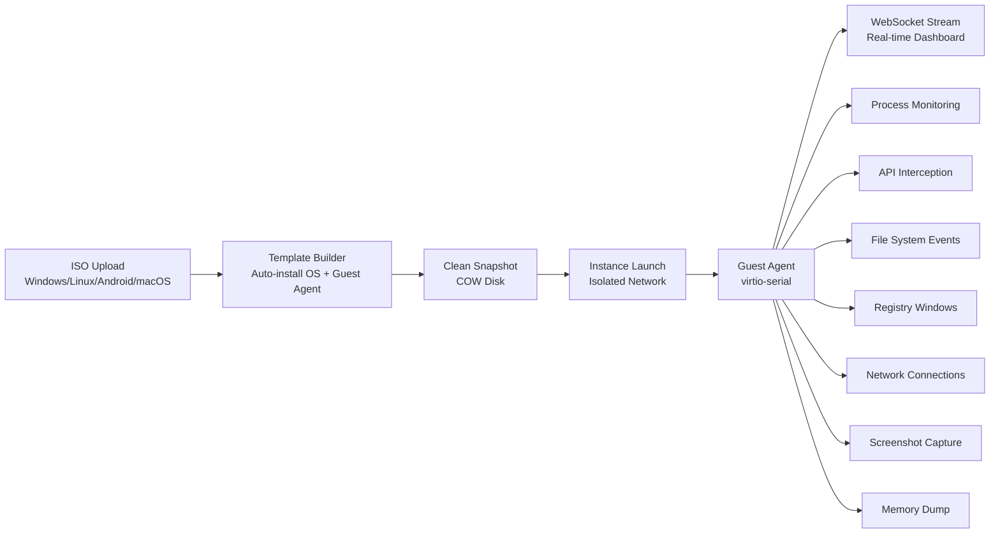

<p align="center">
  <a href="https://github.com/your-org/malinfo">
    
  </a>
</p>

<p align="center">
  
  
  
  
  
  
</p>

<p align="center">
  
</p>

---

## 🛡️ Government-Grade Malware Analysis Platform

> **MALINFO v2.0.0** — A comprehensive, production-ready malware analysis platform built for **CERTs, SOCs, and national cyber defense operations**. Features **built-in dynamic sandbox**, static analysis, network forensics, real-time monitoring, public threat reporting, and **automated agency notifications** — all without requiring external infrastructure.

### 🎯 Why MALINFO?

<table>
<tr>
<td width="50%">

### 🔬 **Complete Analysis Pipeline**
- **Static**: PE/ELF/Mach-O/APK/OLE/Script deep analysis
- **Dynamic**: Built-in VM orchestrator (libvirt/QEMU)
- **Network**: PCAP, JA3, DGA, C2, beaconing analysis
- **Threat Intel**: STIX/TAXII, MISP, ATT&CK Navigator

</td>
<td width="50%">

### 🏛️ **Government-Ready**
- Auto-notify **CERT-In, Cyber Crime Portal, State Cyber Cell**
- Formal structured incident reports (Gov format)
- RBAC + MFA + Audit logging (tamper-evident)
- Air-gap deployment verified
- FIPS 140-2 ready

</td>
</tr>
<tr>
<td>

### 💰 **Zero Cost Production**
- Oracle Cloud Free Tier (4 CPU, 24GB RAM, 200GB)
- DuckDNS + Cloudflare Tunnel = Free TLS/WAF
- Gmail SMTP for agency emails
- **$0/month forever**

</td>
<td>

### ⚡ **Real-Time Everything**
- WebSocket live analysis updates
- Guest agent: process tree, API calls, files, registry, network
- Screenshot capture, memory dump trigger
- MITRE ATT&CK mapping in real-time

</td>
</tr>
</table>

---

## 🏗️ Architecture



---

## 🎬 Live Demo

<p align="center">
  
  <br/>
  <em>Real-time analyst dashboard with live analysis updates</em>
</p>

<p align="center">
  
  <br/>
  <em>VM template creation → dynamic analysis → real-time behavioral monitoring</em>
</p>

<p align="center">
  
  <br/>
  <em>Automatic formatted incident report sent to CERT-In & Cyber Crime Portal</em>
</p>

---

## 🚀 Quick Start (3 Minutes)

```bash
# 1. Clone & Initialize
git clone https://github.com/your-org/malinfo.git
cd malinfo
make init

# 2. Generate Secrets (SAVE OUTPUT!)
make secrets

# 3. Configure
cp .env.example .env
# Edit: ALLOWED_ORIGINS, SMTP, API keys, etc.

# 4. Deploy (Oracle Cloud Free Tier recommended)
make prod

# 5. Verify
make health
```

### 🆓 Free Production Deployment

| Component | Provider | Cost |
|-----------|----------|------|
| **Compute + KVM** | Oracle Cloud Always Free | $0 |
| **Domain** | DuckDNS (`malinfo.duckdns.org`) | $0 |
| **TLS + WAF** | Cloudflare Tunnel | $0 |
| **Email** | Gmail SMTP (App Password) | $0 |
| **Total** | **Forever Free** | **$0/month** |

---

## 🖥️ Built-In VM Sandbox — No CAPEv2 Required

<details>
<summary><b>🎯 Click to expand VM Sandbox capabilities</b></summary>

### Architecture



### Guest Agent Capabilities Matrix

| Capability | Windows | Linux | Android | macOS |
|------------|:-------:|:-----:|:-------:|:-----:|
| Process Tree | ✅ WMI/ETW | ✅ procfs | ✅ | ✅ |
| API Interception | ✅ ETW/DLL Hook | ✅ auditd/ptrace | ✅ Frida | ✅ DTrace |
| File System Events | ✅ FSRM/Polling | ✅ inotify | ✅ | ✅ FSEvents |
| Registry Monitoring | ✅ | N/A | N/A | N/A |
| Network Connections | ✅ GetTcpTable | ✅ /proc/net | ✅ | ✅ |
| Screenshot Capture | ✅ GDI | ✅ X11/Wayland | ✅ | ✅ |
| Memory Dump Trigger | ✅ COM | ✅ gcore | ✅ | ✅ |

### Admin Workflow
1. **VM Management → ISOs** → Upload ISO
2. **VM Management → Templates** → Create (auto-builds, 10-30 min)
3. Status: `building` → `ready`

### Analyst Workflow
1. **Submit Analysis** → Select sample + template
2. Configure: Screenshots, Memory, Network, API Monitoring
3. **Real-time WebSocket updates** → Process tree, MITRE, PCAP, screenshots
4. Download: HTML/JSON reports, STIX packages, PCAP files

</details>

---

## 📊 Agency Notification System

### 🎯 Automatic on Every Citizen Report

<table>
<tr>
<td align="center" width="25%">

<br/><small>incident@cert-in.org.in</small>
</td>
<td align="center" width="25%">

<br/><small>cybercrime@gov.in</small>
</td>
<td align="center" width="25%">

<br/><small>cybercell@police.gov.in</small>
</td>
<td align="center" width="25%">

<br/><small>ary4ntom4r@gmail.com</small>
</td>
</tr>
</table>

### 📧 Formal Government Email Format

```text
================================================================================
MALINFO INCIDENT REPORT
================================================================================

Report Reference: MALINFO-ABC12345
Agency: CERT-In (Indian Computer Emergency Response Team)
Date/Time (UTC): 2026-08-05 10:56:55
Report ID: abc123

INCIDENT CLASSIFICATION
----------------------------------------
Type: FILE
Severity: HIGH
Risk Score: 85/100
Verdict: malicious

SUBMITTER INFORMATION
----------------------------------------
Submitted By: John Doe
Contact: john@example.com
Reference Code: MALINFO-ABC12345

FILE INFORMATION
----------------------------------------
Filename: malware.exe
Size: 102400 bytes
SHA256: d41d8cd98f00b204e9800998ecf8427e
MD5: d41d8cd98f00b204e9800998ecf8427e
SHA1: da39a3ee5e6b4b0d3255bfef95601890afd80709
Target OS: windows

INDICATORS OF COMPROMISE (IOCs)
----------------------------------------
  • HASH: d41d8cd98f00b204e9800998ecf8427e (Confidence: 0.9)
  • IP: 192.168.1.100 (Confidence: 0.8)

MITRE ATT&CK TECHNIQUES
----------------------------------------
  • T1486 (Data Encrypted for Impact)
  • T1059 (Command and Scripting Interpreter)
  • T1566 (Phishing)

NETWORK ANALYSIS
----------------------------------------
  • TCP 192.168.1.50:54321 → 192.168.1.100:443 (ESTABLISHED)
  • DNS A: c2.evil.com → 192.168.1.100

RECOMMENDED ACTIONS
----------------------------------------
  1. Isolate affected system immediately
  2. Block C2 IP at firewall
  3. Initiate incident response procedure

================================================================================
END OF REPORT
Generated by MALINFO Platform at 2026-08-05 05:26:55 UTC
================================================================================
```

---

## 🔌 API Reference

<details>
<summary><b>📚 Core Endpoints (71 total)</b></summary>

### Authentication
| Endpoint | Method | Description |
|----------|--------|-------------|
| `/auth/login` | POST | Login with MFA |
| `/auth/refresh` | POST | Refresh access token |
| `/auth/me` | GET | Current user profile |

### Samples & Analysis
| Endpoint | Method | Description |
|----------|--------|-------------|
| `/upload` | POST | Upload file for analysis |
| `/reports` | GET | List samples (paginated) |
| `/reports/{id}` | GET | Sample details + verdict |
| `/reports/{id}/html` | GET | Interactive HTML report |

### VM Sandbox (14 endpoints)
| Endpoint | Method | Description |
|----------|--------|-------------|
| `/vm/isos` | GET/POST/DELETE | ISO management |
| `/vm/templates` | GET/POST/DELETE | VM template CRUD |
| `/vm/templates/{id}/rebuild` | POST | Rebuild template |
| `/vm/analyze` | POST | Submit dynamic analysis |
| `/vm/tasks` | GET | List analysis tasks |
| `/vm/tasks/{id}/status` | GET | Real-time status |
| `/vm/tasks/{id}/report` | GET | Download report |
| `/vm/tasks/{id}/pcap` | GET | Download PCAP |
| `/vm/tasks/{id}/screenshots` | GET | Get screenshots |
| `/vm/ws/{task_id}` | WS | Live WebSocket updates |

### Public Reporting (3 endpoints)
| Endpoint | Method | Description |
|----------|--------|-------------|
| `/public/report/details` | POST | Report URL/IP/app (no file) |
| `/public/report/file` | POST | Report malicious file |
| `/public/report/{id}/status` | GET | Check report status |

### Threat Intelligence
| Endpoint | Method | Description |
|----------|--------|-------------|
| `/threat-intel/lookup/hash/{hash}` | POST | Hash reputation |
| `/threat-intel/lookup/ip/{ip}` | POST | IP reputation |
| `/threat-intel/enrich/sample/{id}` | POST | Full sample enrichment |

</details>

---

## 📦 Deployment Options

### Docker Compose (Recommended)

```bash
# Development
make dev

# Staging
make staging

# Production (full stack)
make prod

# With profiles
docker compose -f docker-compose.prod.yml \
  --profile monitoring --profile icap --profile monitor up -d
```

### Kubernetes (Helm-Ready)

```bash
kubectl apply -f deploy/kubernetes/
# Secrets, TLS, Ingress, HPA, PodSecurityPolicy included
```

### systemd (Bare Metal)

```bash
sudo systemctl enable --now malinfo-backend malinfo-icap malinfo-monitor
```

### 🆓 Free Tier Deploy (Oracle Cloud)

```bash
# On Oracle VM (ARM, 4 OCPU, 24GB RAM, 200GB)
git clone https://github.com/your-org/malinfo.git
cd malinfo && make secrets && cp .env.example .env && vim .env
make prod

# Cloudflare Tunnel (free TLS)
cloudflared tunnel login
# config.yml → malinfo.duckdns.org → https://localhost:443
sudo cloudflared service install && sudo systemctl enable --now cloudflared
```

---

## 🛡️ Security Hardening

### Network
- TLS 1.3 only, HSTS preload, CSP, X-Frame-Options
- Rate limiting: API 100r/s, Upload 10r/m, Public 5r/m
- ICAP gateway restricted to authorized infrastructure

### Application
- JWT HS256 (8h access / 30d refresh)
- bcrypt cost=12, TOTP MFA, RBAC (5 roles, 20+ perms)
- Tamper-evident audit logs, API keys with scopes

### Infrastructure
```ini
NoNewPrivileges=true
PrivateTmp=true
ProtectSystem=strict
ProtectHome=true
ProtectKernelTunables=true
ProtectKernelModules=true
RestrictNamespaces=true
LockPersonality=true
MemoryDenyWriteExecute=true
SystemCallFilter=@system-service
```

### Supply Chain
- SBOM (CycloneDX): `make sbom`
- Dependency scan: `make security` (Safety + Trivy)
- Container signing ready (cosign)
- SLSA Level 3 pipeline ready

---

## 📈 Monitoring & Observability

<p align="center">
  
</p>

### Pre-Provisioned Dashboards
- **System Overview** — Health, API rates, resources, disk
- **Analysis Pipeline** — Queue depth, duration, verdicts, MITRE heatmap
- **Sandbox Status** — VM pool, task queue, guest agent health

### Key Metrics
| Metric | Type | Description |
|--------|------|-------------|
| `http_requests_total` | Counter | Requests by method/handler/status |
| `http_request_duration_seconds` | Histogram | Latency percentiles |
| `malinfo_analysis_queue_depth` | Gauge | Static analysis backlog |
| `malinfo_sandbox_malscore` | Histogram | Sandbox score distribution |
| `malinfo_yara_matches_total` | Counter | YARA rule matches |

### Alerting (Prometheus)
- Service down (backend, nginx, db, redis)
- Error rate > 5%, p95 latency > 5s
- Analysis queue backlog, sandbox unavailable
- Disk < 15%, TLS expiry < 30 days

---

## ⚙️ Configuration

### Required Environment Variables
| Variable | Description | Required |
|----------|-------------|:--------:|
| `SECRET_KEY` | JWT signing key (32+ chars) | ✅ |
| `DATABASE_URL` | PostgreSQL connection string | ✅ |
| `REDIS_URL` | Redis connection string | ✅ |
| `POSTGRES_PASSWORD` | Database password | ✅ |
| `ALLOWED_ORIGINS` | CORS origins (JSON array) | ✅ |
| `GRAFANA_PASSWORD` | Grafana admin password | ✅ |

### Agency Notification (SMTP)
| Variable | Description | Default |
|----------|-------------|---------|
| `SMTP_HOST` | SMTP server | `smtp.gmail.com` |
| `SMTP_PORT` | SMTP port | `587` |
| `SMTP_USER` | Username | — |
| `SMTP_PASSWORD` | App Password | — |
| `AGENCY_NOTIFICATION_EMAIL` | Default recipient | `ary4ntom4r@gmail.com` |

### Optional Integrations
| Variable | Use Case |
|----------|----------|
| `VIRUSTOTAL_API_KEY` | Hash/URL/IP reputation |
| `OTX_API_KEY` | AlienVault OTX enrichment |
| `ABUSEIPDB_API_KEY` | AbuseIPDB IP reputation |
| `MISP_URL` / `MISP_API_KEY` | MISP sync |
| `VM_ORCHESTRATOR_ENABLED` | Enable built-in sandbox |

---

## 📋 Government Acceptance Criteria

<table>
<tr>
<td width="50%">

### ✅ Functional
- [ ] 1000 samples/day on 8-core/32GB
- [ ] Static analysis < 30s (1-10MB PE)
- [ ] Dynamic analysis < 5 min typical
- [ ] YARA 50K rules < 5s on 10MB
- [ ] PCAP 100MB < 60s
- [ ] Report generation < 10s
- [ ] 99.9% API availability (HA)
- [ ] Zero cross-org data leakage

</td>
<td>

### ✅ Security
- [ ] Pen test: 0 critical/high
- [ ] 0 critical/high CVEs in prod images
- [ ] SBOM all components
- [ ] Images signed (cosign)
- [ ] FIPS 140-2 operational
- [ ] Tamper-evident audit logs
- [ ] Air-gap update verified

</td>
</tr>
<tr>
<td>

### ✅ Operational
- [ ] Deploy: K8s, Docker, bare-metal, air-gap
- [ ] Runbooks: backup/restore, failover, scaling
- [ ] Dashboards: system, business, security
- [ ] Alerts: SLAs, anomalies, critical paths
- [ ] Capacity planning guide

</td>
<td>

### ✅ Usability
- [ ] Triage workflow < 5 min
- [ ] Report customization no-code
- [ ] YARA create/test/deploy < 2 min
- [ ] Threat feed add/sync < 1 min
- [ ] Case management: create, assign, track

</td>
</tr>
</table>

---

## 🤝 Contributing

This is a government/internal project. For security issues, contact: **security@example.gov**

For feature requests or improvements, use the internal tracking system.

---

## 📄 License

**Government Use Authorized** — See [LICENSE](LICENSE) for details.

---

## 🔗 Links

<p align="center">
  <a href="https://malinfo.example.gov">
    
  </a>
  <a href="https://malinfo.example.gov/docs">
    
  </a>
  <a href="https://github.com/your-org/malinfo/wiki">
    
  </a>
  <a href="mailto:security@example.gov">
    
  </a>
</p>

---

<p align="center">
  <b>Built with ❤️ for National Cyber Defense</b><br/>
  <sub>MALINFO v2.0.0 — Protecting Digital Sovereignty</sub>
</p>

<p align="center">
  
</p>